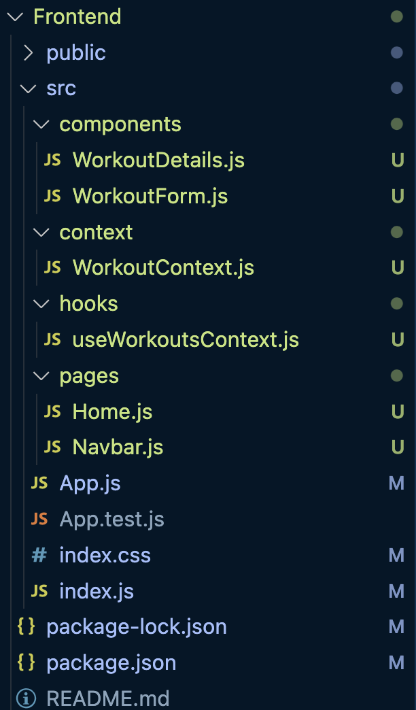
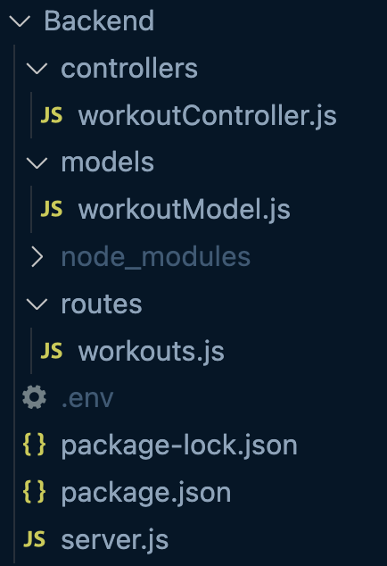
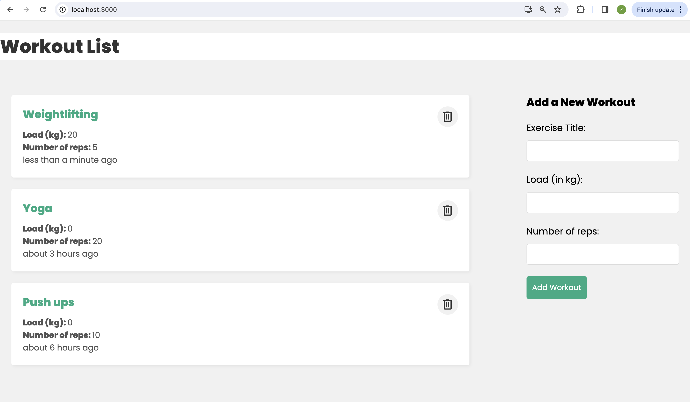

# MERN-Project

An exercise consisting of a **React** client and an **Express** server interacting with **REST API** and storing data in **MongoDB**

## Prerequisites

- [Node.js](https://nodejs.org/en/) installed
- [npm](https://www.npmjs.com/) installed

## Installation of Backend

1. Go to backend directory

```sh
cd Backend
```

2. Install project dependencies

```sh
npm install
```

3. Start application

```sh
npm run dev
```

## Installation of Frontend

1. Go to frontend directory

```sh
cd Frontend
```

2. Install project dependencies

```sh
npm install
```

3. Start application

```sh
npm start
```

4. View application
The application will be available at [http://localhost:3000](http://localhost:3000)

## Configuration

Frontend and backend both support configuration via environment variables.

**Backend**
- `PORT` - The port of the application (default is `4000`)

**Frontend**
- `PORT` - The port of the application (default is `3000`)
- `REACT_APP_BACKEND_URL` - The base url of the backend application (default is `http://localhost:4000/api/workouts`)

## Routes
The following routes are available:

| Endpoint | Method | Description |
|---|---|---|
| /api/workouts/ | GET | Get all workouts. |
| /api/workouts/:id | GET | Get a single workout by id. |
| /api/workouts/ | POST | Create a new workout. |
| /api/workouts/:id | DELETE | Delete a workout by id. |
| /api/workouts/:id | UPDATE | Update a workout by id. |

## Frontend project structure


## Backend project structure


## DEMO
